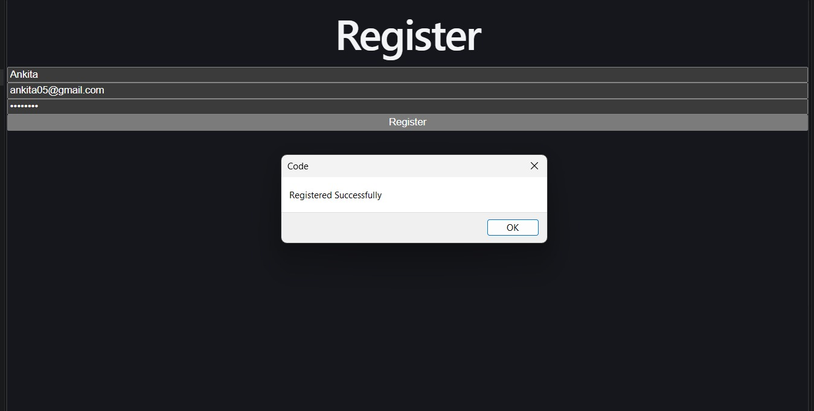
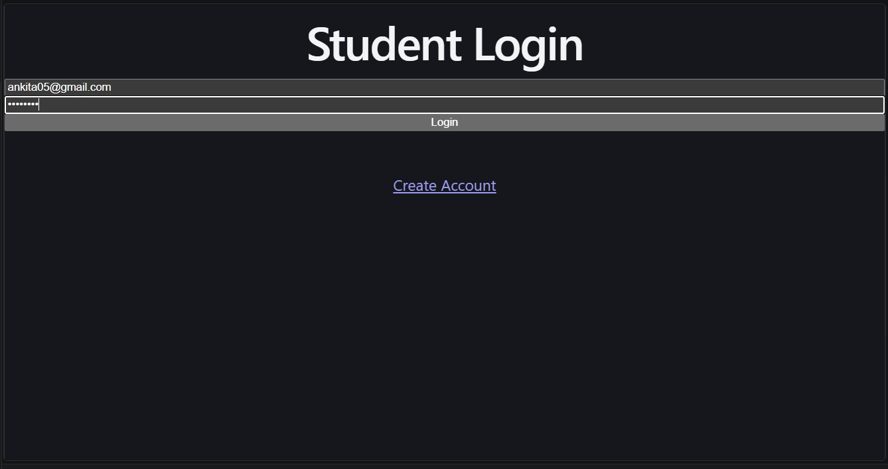
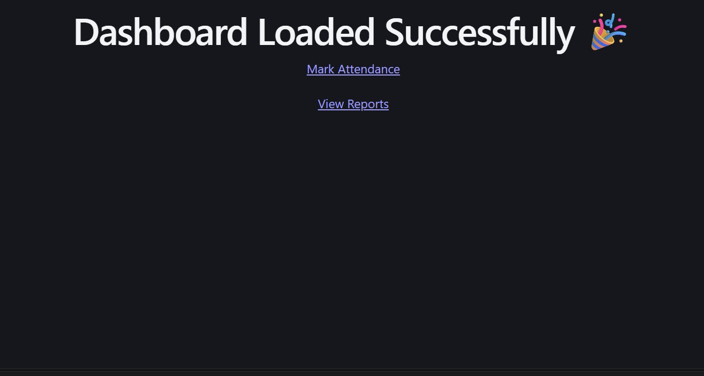
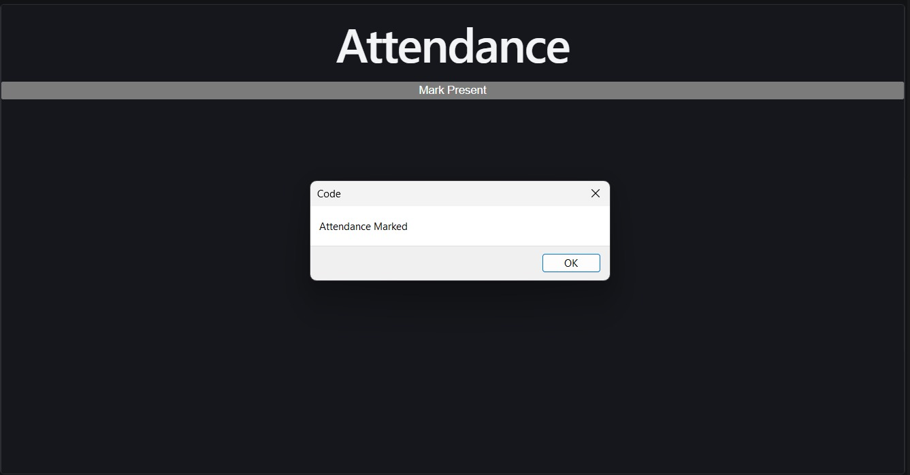
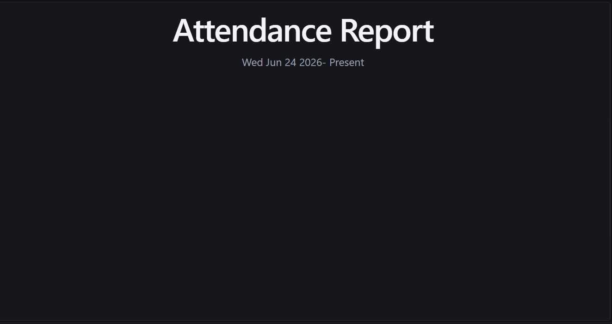

# Student Attendance Management System

A full-stack MERN application that allows students to register, log in securely, mark attendance, and view attendance reports using JWT authentication and MongoDB.

## Features

* User Registration
* User Login with JWT Authentication
* Password Encryption using bcryptjs
* Mark Attendance
* View Attendance Reports
* MongoDB Database Integration
* RESTful API using Express.js
* Protected Routes
* React Frontend

## Tech Stack

### Frontend

* React.js
* Axios
* React Router DOM
* Vite

### Backend

* Node.js
* Express.js
* MongoDB
* Mongoose
* JWT Authentication
* bcryptjs
* dotenv
* cors

## Project Structure

```text
student-attendance-management-system/
│
├── backend/
│   ├── controllers/
│   ├── middleware/
│   ├── models/
│   ├── routes/
│   ├── server.js
│   └── .env
│
├── frontend/
│   ├── src/
│   │   ├── pages/
│   │   │   ├── Login.jsx
│   │   │   ├── Register.jsx
│   │   │   ├── Dashboard.jsx
│   │   │   ├── Attendance.jsx
│   │   │   └── Reports.jsx
│
├── screenshots/
│
└── README.md
```

## Installation

### Clone the Repository

```bash
git clone https://github.com/prachistudentmin24-sys/student-attendance-management-system.git
cd student-attendance-management-system
```

### Backend Setup

```bash
cd backend
npm install
```

Create a `.env` file inside the backend folder:

```env
MONGO_URI=your_mongodb_connection_string
JWT_SECRET=your_secret_key
```

Start the backend server:

```bash
npm run dev
# or
node server.js
```

### Frontend Setup

```bash
cd frontend
npm install
npm run dev
```

## API Endpoints

### Authentication

| Method | Endpoint           | Description            |
| ------ | ------------------ | ---------------------- |
| POST   | /api/auth/register | Register a new student |
| POST   | /api/auth/login    | Login student          |

### Attendance

| Method | Endpoint               | Description           |
| ------ | ---------------------- | --------------------- |
| POST   | /api/attendance/mark   | Mark attendance       |
| GET    | /api/attendance/report | Get attendance report |

## Security Features

* JWT-based Authentication
* Password Hashing with bcryptjs
* Protected Routes
* Environment Variables for Sensitive Data

## Future Improvements

* Attendance Percentage Calculation
* Admin Dashboard
* Student Management
* Attendance Analytics
* Export Attendance Reports
* Email Notifications

## 📸 Screenshots

### Register Page

New users can create an account securely.



### Login Page

Students can log in using email and password.



### Dashboard

Central hub to navigate attendance features.



### Mark Attendance

Students can mark themselves present.



### Attendance Report

View complete attendance history.



## Author

Prachi

Built with ❤️ using MongoDB, Express.js, React, and Node.js.